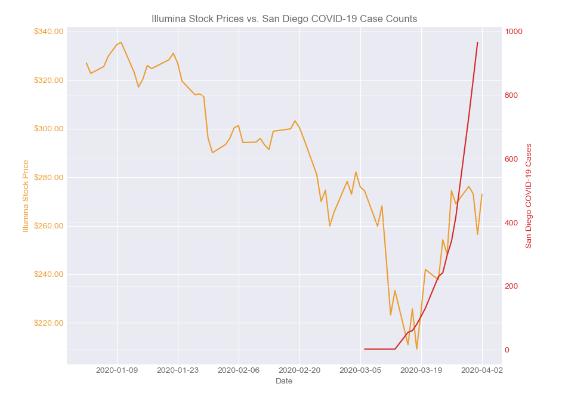

# 2020 Illumina Inc Stock Prices (ILMN) vs San Diego COVID-19 Case Counts

## Background

This started off as an assignment for the University of Michigan's Final Project for the [Applied Plotting, Charting & Data Representation in Python](https://www.coursera.org/learn/python-plotting?specialization=data-science-python) course (Course 2) on Coursera. I had already been very much diving into the San Diego COVID-19 Case Counts and running various analyses on their numbers and researching correlations with various other datasets.

I decided to compare the San Diego COVID-19 Case Counts with the stock prices of a San Diego-based company, and Illumina, Inc. (ILMN) happens to fit the bill. Illumina happens to be one of the top biotechnology companies in the world 

The goal is to chart a quick comparison and visual to see the rising San Diego COVID-19 case counts as of April 1st to the stock prices of Illumina (ILMN). The stock prices are from January to April 1st of 2020. Data taken from [Nasdaq.com](https://www.nasdaq.com/).

